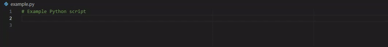

# TabRuler extension

TabRuler allows users to jump to the next vertical ruler in VSCode by hitting the `Space` key twice in quick succession. This makes it easier to keep inline comments organized. TabRuler is especially helpful in combination with VSCode's auto-complete feature.

## Features

TabRuler finds the next ruler on double tap of `Space` and inserts as many spaces as required to reach the ruler. If no ruler is found, 2 spaces are inserted instead, as if just two spaces had been typed.

## Extension Settings

This extension contributes the following settings:

* `tabruler.doubleTapTime`: Time in milliseconds to detect double-tap of bthe space key.

## Known Issues

No known issues.

## Release Notes

For the full release notes, see [the changelog](https://github.com/tarymaas/tabruler/blob/main/CHANGELOG.md).

## About

* [GitHub repository](https://github.com/tarymaas/tabruler)